# Prestige Motors product improvement audit

Date: 29 August 2026

Production reviewed: https://prestige-motors-showroom-free-servi-mu.vercel.app

Scope: read-only review of the customer showroom, vehicle details, compare, booking, trade-in, assistant, admin entry, mobile layouts, translation, and production architecture.

## Overall verdict

The new visual direction is strong and worth preserving: it feels distinctive, premium, editorial, and far more credible than a generic dealership template. The largest remaining gaps are not a full redesign. They are production truth, content completeness, mobile floating-control collisions, conversion efficiency, and a translation system that currently produces mixed-language pages.

No application code or production data was changed during this audit.

## Journey health

| Step | Health | What the evidence shows |
| --- | --- | --- |
| 1. Homepage hero, desktop | Good with caveats | Clear brand, strong hierarchy, useful primary actions; fixed language and assistant controls intrude into page content. |
| 2. Homepage hero, mobile | Needs attention | Visual identity holds up, but the two floating utilities consume too much of the lower viewport and cover content. |
| 3. Inventory, mobile | Needs attention | Filtering exists, but the section heading wastes vertical space, controls overlap cards, and listing data/photography is not credible enough for production. |
| 4. Vehicle details | Needs attention | Excellent hierarchy and CTA clarity; incomplete trust evidence, only two photos, missing specs, and unsupported copy weaken trust. |
| 5. Compare, empty | Good | The empty state explains the task and provides a direct next step. |
| 6. Compare, populated | Needs attention | The comparison is visually strong, but too many rows say “Ask showroom” or “Not assigned,” so the feature exposes weak listing data. |
| 7. Test-drive entry | Needs attention | Strong message, but the oversized hero hides the conversion form below the fold. |
| 8. Test-drive form | Good with caveats | Clear labels and expectations; the date field uses a US-looking `mm/dd/yyyy` format and the flow lacks confirmed slot/reschedule UX. |
| 9. Trade-in | Needs attention | Clear and trustworthy copy, but the long single-page form should become a resumable, guided multi-step flow. |
| 10. AI assistant | Needs attention | Good dialog semantics, focus handling, human handoff, and inventory-aware architecture; the empty state is sparse, chips clip horizontally, and other fixed controls remain visible beneath the modal. |
| 11. Admin login | Good with caveats | Professional, clear, and security-oriented; it needs login throttling, 2FA, account recovery, and better wide-screen use. |
| 12. Bahasa Melayu translation | Critical | The live page visibly mixes Malay and English. The current client-side DOM/AI translation approach is delayed, non-deterministic, and unsuitable as the final production localization architecture. |

## Priority 0 — fix before promoting the site heavily

1. Replace demo/sample vehicle records with real dealer inventory and credible Malaysian market prices.
2. Remove database seeding from every Vercel production build. `package.json` currently runs `npm run db:seed` inside `vercel-build`, which can overwrite or reintroduce sample production data.
3. Separate preview/staging and production databases; never let preview deployments write to the production Neon database.
4. Require a complete listing before publication: stock ID, registration year, model variant, body type, exterior/interior colour, seats, drivetrain, assembly/import type, location, mileage, ownership/history status, and verified price.
5. Require genuine, vehicle-specific photography and make year/model/photo consistency part of the publish check. The “2026 Toyota Vios” currently appears with a mismatched older-looking vehicle image and hash-like alternative text.
6. Raise the minimum photo set to at least 12 useful shots for public listings; the audited BMW page has only two.
7. Do not publish factual claims such as “documented service history,” “original paintwork,” or “clean inspection report” unless evidence is present in the trust pack.
8. Publish a real trust pack or explicitly mark every unverified fact. Include inspection date, inspector/provider, documents, service history, ownership/accident/flood checks, warranty, and limitations.
9. Clarify pricing: advertised vehicle price, drive-away price, fees, road tax, insurance, transfer, and finance assumptions must not appear interchangeable.
10. Separate Available, Reserved, and Sold inventory. Do not place a sold vehicle inside “Fresh arrivals” without a clear sold/archive treatment.
11. Fix mixed-language pages. All interface copy, accessibility labels, errors, metadata, admin strings, and dynamic states must be translated consistently.
12. Replace runtime DOM mutation and on-demand AI translation with typed, reviewed server-rendered message catalogs and locale routes such as `/en`, `/ms`, and `/zh`.
13. Add a production smoke test for the assistant that verifies Gemini/Gateway mode, grounded answers, fallbacks, and error reporting without silently repeating a generic response.
14. Add login attempt throttling, temporary lockout, audit logging, and 2FA for dealer administration.

### Evidence-backed engineering blockers

- **Stored script injection risk:** admin-controlled vehicle fields are inserted into JSON-LD with raw `JSON.stringify`. Escape `<` as `\u003c` or use a safe JSON-LD serializer on both the homepage and detail page before accepting untrusted listing text.
- **Configuration fails open:** dealer phone/email fall back to personal values when production environment variables are missing. Add a production environment schema and fail deployment when dealer identity, canonical URL, auth, cron, database, storage, email, or AI configuration is incomplete.
- **Admin credentials are not cleanly revocable:** the environment password can upsert/overwrite the database administrator during login, and the deploy seed repeats the overwrite. Replace this with one-time provisioning, explicit password reset/change, revoked/disabled state, and session invalidation.
- **Appointment capacity can be abused:** unverified `REQUESTED` appointments consume a limited slot. Add contact verification, duplicate-contact controls, CAPTCHA/honeypot, a booking horizon, and a temporary-hold/confirmation model.
- **Trade-in photos are public and can become orphaned:** photos upload before the appraisal record exists and use public car-image delivery. Use private or signed delivery, create an upload session, bind files to the final request, and automatically remove abandoned uploads.
- **“Permanent” enquiry deletion is incomplete:** the same customer data is copied into Enquiry, Lead, and Notification records without a lifecycle link, so deleting only the enquiry leaves PII behind. Model the relationship and implement one auditable retention/erasure workflow.
- **Email and cron work is not durable:** customer notifications rely on `after()` and console errors, while the engagement cron can partially complete. Add a database outbox/job queue, idempotency, leases, bounded concurrency, retries, dead-letter state, and an operator-visible delivery dashboard.
- **Admin records disappear at scale:** several workspaces hard-limit results to 100 with no cursor or total; other pages load all records/images. Add server-side cursor pagination, totals, filters, and search throughout admin.
- **Analytics can be inaccurate or spoofed:** charts truncate event sets, “qualified” does not match its label, and public client events can be fabricated. Define trusted server-side conversion events, Malaysia-time aggregation, bot filtering, cohort semantics, and data-quality warnings.
- **Consent is inconsistent:** the enquiry route records `consentAt` although the corresponding form has no consent field. Store legal basis, exact consent text/version/source, and implement PDPA retention/export/deletion workflows.
- **Public inventory queries will not scale:** the dynamic homepage performs duplicate/full inventory reads with all images and unindexed substring search. Add pagination, cover-image projections, result counts, indexed search, and tag-based caching/revalidation.
- **Missing browser hardening:** add a tested Content Security Policy, HSTS, frame protection, `X-Content-Type-Options`, Referrer Policy, and Permissions Policy.
- **Sitemap quality needs correction:** remove the fragment-only `/#inventory` entry, include all meaningful public routes, use truthful modification dates, and prevent filter-query duplicates with canonical metadata.
- **Release safety is not automated:** add CI gates for clean install, Prisma validation/migration drift, lint, typecheck, build, dependency/secret scanning, accessibility checks, and end-to-end coverage of auth, CRUD, booking collisions, uploads, alerts, cron idempotency, assistant fallback, and localization.

## Priority 1 — conversion and mobile usability

15. Merge or relocate the language selector and assistant launcher so fixed controls never cover filters, cards, forms, or mobile safe areas.
16. Hide/inert all background utilities while the assistant dialog is open.
17. Reduce the test-drive and trade-in hero height so the first form fields and value proposition appear above the fold.
18. Reduce the mobile “Fresh arrivals” heading size and blank space so users reach inventory sooner.
19. Build a mobile filter/sort sheet with applied-filter count, active chips, clear-all, result count, and a persistent filter button.
20. Add Malaysia-relevant filters: local/recon, monthly budget, warranty, state/location, body type, fuel, year, mileage, transmission, and availability.
21. Add useful sorting: newest listed, price, year, mileage, recently reduced, and available first.
22. Make the full vehicle card a clear tap target and add registration year, stock ID, location, one trust signal, and one differentiator.
23. Show monthly payment only when assumptions are visible and valid; never let an attractive monthly number imply an approved loan.
24. Add a non-overlapping sticky mobile action bar on details: WhatsApp, call, book test drive, and save.
25. Give every car a prefilled WhatsApp message containing model, year, price, stock ID, and listing URL.
26. Choose one primary conversion action per vehicle state. Avoid making the enquiry form, stock alert, assistant, and WhatsApp compete equally.
27. Preselect the vehicle when booking from its detail page and preserve the user’s context.
28. Use Malaysian date/time presentation (`dd/mm/yyyy`, Asia/Kuala_Lumpur) and show only genuinely available appointment slots.
29. Add booking confirmation, calendar invite, WhatsApp/email confirmation, cancellation, and rescheduling.
30. Convert trade-in into Vehicle → Photos → Contact → Review, with progress, back/next, autosave, retryable uploads, examples, and time estimate.
31. Move the long stock-alert form out of the homepage flow into a compact modal or dedicated page using progressive disclosure.
32. Improve compare: persistent compare count, add/remove toast, shareable URL, highlighted differences, hidden identical/unknown rows, and “best for” summaries.
33. Improve empty/loading/error states with recommended available cars, retry, contact, and skeletons instead of generic blank space.
34. Format the visible phone number consistently as `+60 12-727 0107` while keeping the WhatsApp destination unchanged.

## Priority 2 — professional dealership credibility

35. Add a custom domain and branded email domain; replace the long Vercel subdomain in customer-facing use.
36. Create a proper logo lockup, favicon set, social/OG graphics, and consistent brand asset pack while preserving the current black/white/red identity.
37. Add the full showroom address, operating hours, map, Waze/Google Maps directions, parking/viewing notes, and a clear service area.
38. Add real showroom/team photography, company/SSM identity, “About us,” purchase process, and named contact roles.
39. Add verified Google/customer reviews and delivery stories with consent; avoid generic anonymous testimonials.
40. Expand the vehicle gallery to standardized exterior/interior angles, imperfections, documents where safe, captions, zoom/lightbox, video, and optional 360 view.
41. Replace vague badges such as “verified by dealer” with who verified it, what was checked, and when.
42. Add useful ownership-cost context: road tax, insurance estimate, warranty, servicing, fuel/charging, and common next maintenance.
43. Add a Malaysia-specific FAQ covering loan documents, JPJ/ownership transfer, PUSPAKOM where applicable, warranty, trade-in, deposits, and test drives.
44. Add recently viewed vehicles, saved searches, account-less favorites, price-drop indicators, and shareable shortlists.
45. Create an available-inventory archive and a separate sold/delivered gallery; never mix sold stock into current results.
46. Give vehicle descriptions a structured editor with verified highlights, condition notes, known defects, service history, viewing details, and explicit evidence links.

## Priority 2 — AI, localization, accessibility, SEO, and performance

47. Render assistant vehicle recommendations as real cards with photo, price, availability, and action buttons instead of relying mainly on text links.
48. Add answer citations to current listing fields, explicit “AI offline”/fallback status, retry, thumbs feedback, transcript handoff, and an admin quality log.
49. Use durable distributed rate limiting for assistant and translation endpoints; the current in-memory maps reset across serverless instances.
50. Cache reviewed translations durably and ship them with the app; do not ask Gemini to translate ordinary interface copy during a customer visit.
51. Give vehicle descriptions an admin-managed language status and reviewed translations; use an explicit fallback label for untranslated dealer content.
52. Add locale-aware canonical URLs, `hreflang`, localized sitemap entries, and translated structured data.
53. Create a dedicated `/inventory` route and SEO landing pages for make/model/body type/location rather than relying only on a homepage anchor.
54. Expand structured data with `AutoDealer`/`LocalBusiness`, `Vehicle`, breadcrumb, and FAQ markup, using only accurate facts.
55. Fix alternative text quality and prevent filenames/hashes from becoming public alt text.
56. Optimize Cloudinary delivery with responsive `srcset`/sizes, WebP/AVIF, correct aspect ratios, blur placeholders, quality checks, and upload transformations.
57. Replace full-page client DOM scanning/MutationObserver translation with server-rendered messages to improve speed, stability, SEO, and screen-reader behavior.
58. Lazy-load non-critical assistant and long-form code, monitor Core Web Vitals, and remove layout shifts around inventory loading.
59. Complete keyboard, screen-reader, zoom, contrast, reduced-motion, touch-target, translated `lang`, and form-error-summary testing.

## Priority 3 — admin and dealer operations

60. Add admin roles and permissions: owner, manager, sales, inventory editor, and read-only analyst.
61. Add a complete audit log for sign-ins, vehicle edits, status changes, price changes, deletions, lead ownership, and trust evidence.
62. Add password reset/recovery, device/session management, forced secret rotation, and optional passkeys.
63. Add bulk inventory import/export, duplicate listing, scheduled publish/unpublish, bulk status updates, and an approval workflow.
64. Add automated listing-quality checks: missing fields, suspicious price, year/photo mismatch, duplicate images, weak alt text, photo count, and unsupported claims.
65. Add stock aging, days-in-stock, price history, acquisition cost, reconditioning tasks, gross-margin view, and price-review reminders.
66. Add lead ownership, next action, SLA timers, reminders, notes, activity history, duplicate detection, and stale-lead alerts.
67. Add WhatsApp/email templates, consent records, delivery status, retry logs, and opt-out handling.
68. Add quotation/invoice/purchase-agreement PDF workflows with correct Malaysian business details and human approval.
69. Add a lightweight CMS for homepage messaging, contact details, hours, legal content, FAQs, and campaigns so routine edits do not require a deploy.
70. Add analytics for view → save → compare → WhatsApp/call → booking/enquiry → sale, including UTM/source attribution and privacy-safe reporting.

## Priority 3 — security, reliability, compliance, and growth

71. Add bot protection to public forms and uploads, alongside the existing validation and rate limits.
72. Validate upload MIME/content, scan risky files, use signed Cloudinary operations, enforce size/dimension limits, and keep customer documents private.
73. Add Privacy Policy, Terms, PDPA notice, marketing-consent records, retention/deletion rules, and a data-contact route.
74. Add authenticated admin CSRF review, secure cookie/security headers review, dependency scanning, secret scanning, and a documented key-rotation process.
75. Add Sentry or equivalent error monitoring, structured logs, assistant/provider metrics, health checks, uptime alerts, and incident runbooks.
76. Add Neon backup/restore drills, migration rollback plans, Cloudinary asset recovery, and a separate staging environment.
77. Configure SPF, DKIM, and DMARC for branded email; track transactional delivery and bounces.
78. Consider WhatsApp Business API only when the team needs managed conversations, templates, attribution, and opt-in records; keep `wa.me` as a reliable baseline.
79. Add automated end-to-end tests for inventory, compare, booking, trade-in, assistant fallback, login protection, translation, and publish readiness.
80. Add A/B testing only after trustworthy inventory and analytics exist: test hero height, card density, CTA hierarchy, and assistant versus WhatsApp prominence.

## Evidence

1. Homepage hero, desktop
   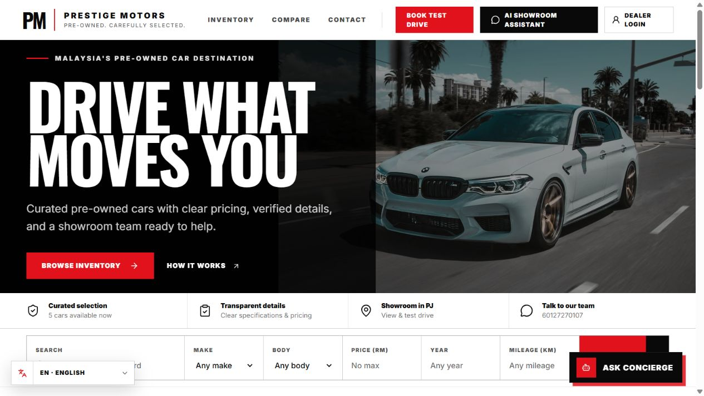

2. Homepage hero, mobile
   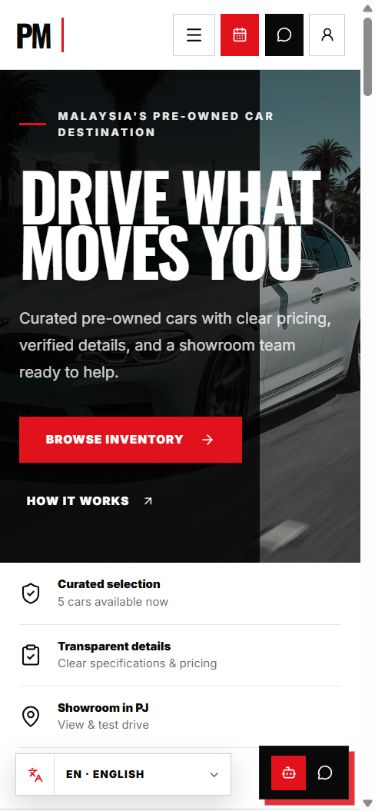

3. Inventory, mobile
   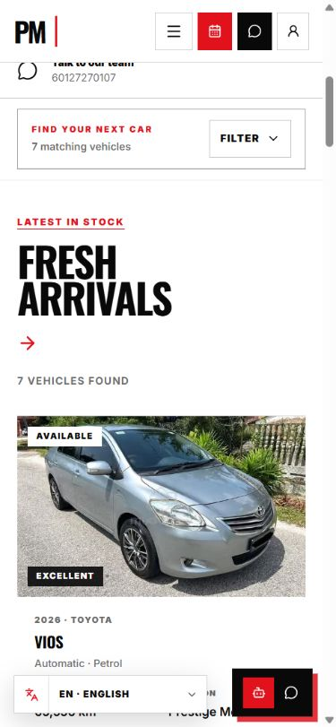

4. Vehicle detail
   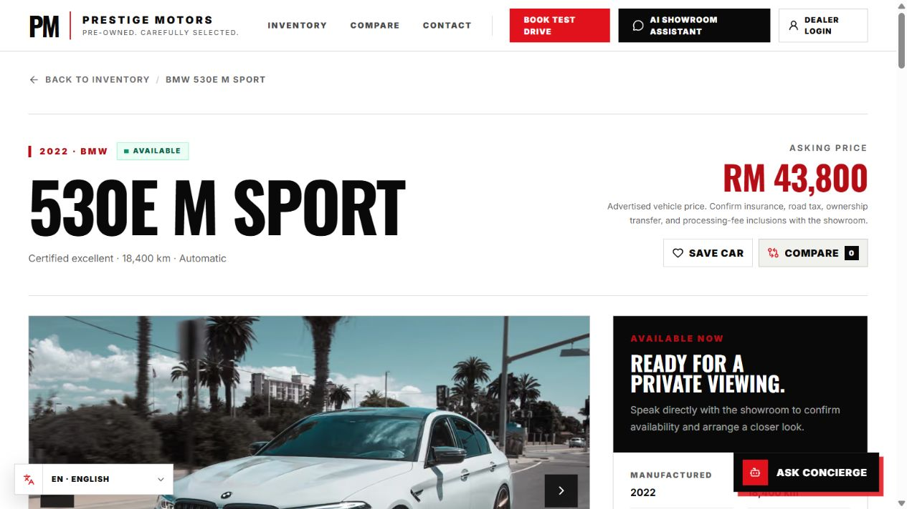

5. Compare empty state
   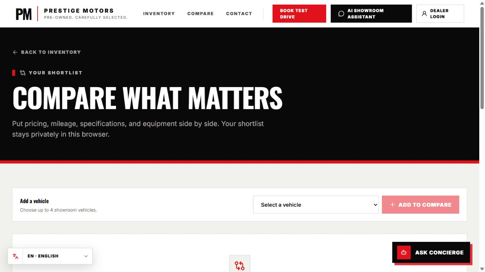

6. Compare with two vehicles
   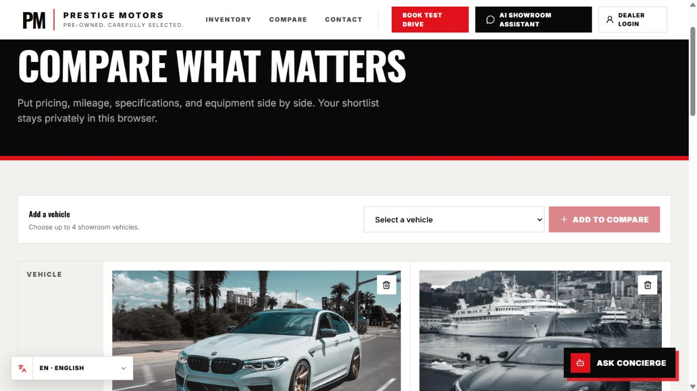

7. Test-drive entry
   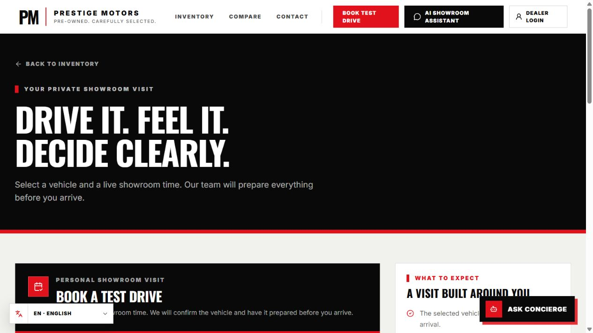

8. Test-drive form
   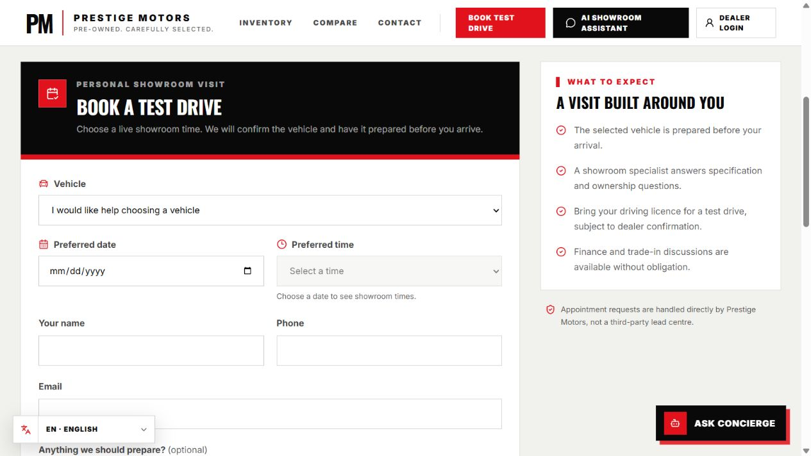

9. Trade-in flow
   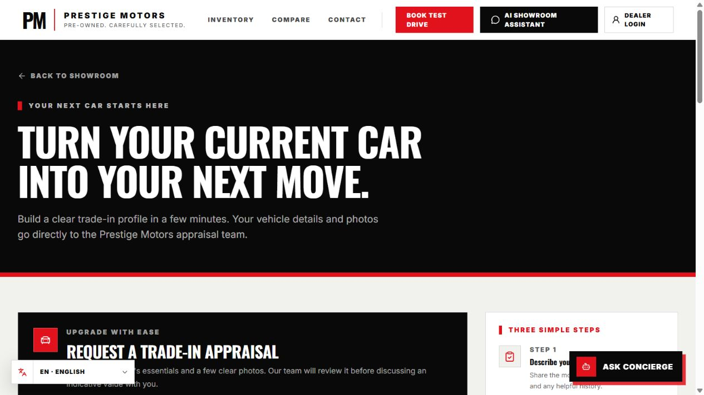

10. AI assistant
    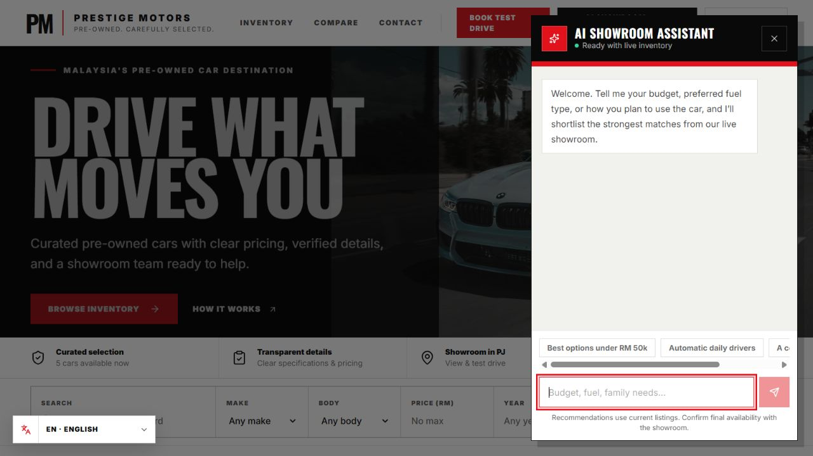

11. Admin login
    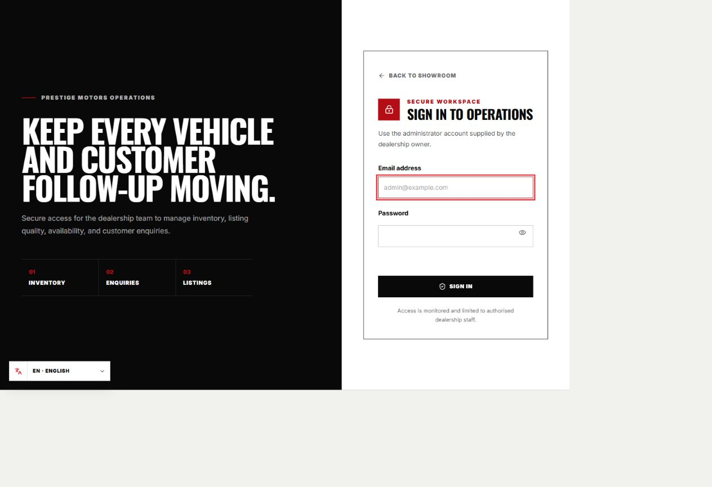

12. Mixed Bahasa Melayu/English translation
    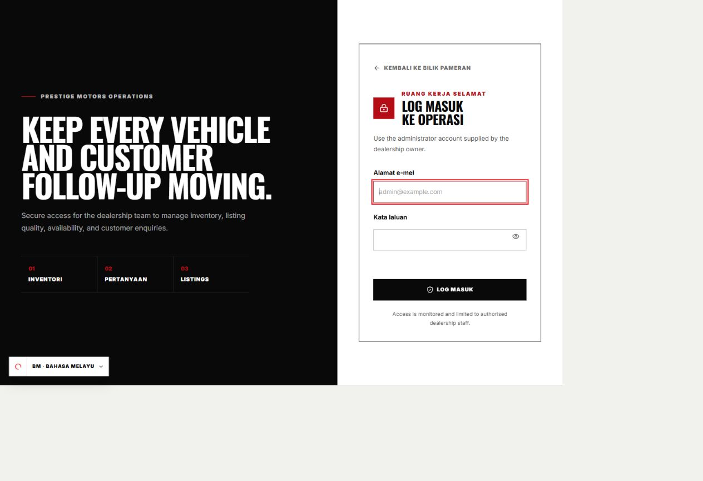

## Strengths to preserve

- The editorial black/white/red visual system and distinctive display typography.
- Clear page hierarchy, strong vehicle imagery, and direct CTA language.
- Accessible landmarks, skip links, labels, dialog semantics, and generally strong focus behavior.
- Transparent finance caveats and the idea of evidence-backed trust packs.
- Compare, trade-in, appointment, alert, analytics, and admin foundations already present in the product.
- AI fallback and human-handoff architecture, which should be made more observable rather than discarded.

## Accessibility limits

This was a visual and semantic DOM review across desktop and mobile layouts. It did not include a full manual screen-reader pass, automated contrast calculation for every state, keyboard traversal of every control, 200–400% zoom testing, reduced-motion verification, or destructive form submissions. Those checks remain necessary before claiming WCAG conformance.
